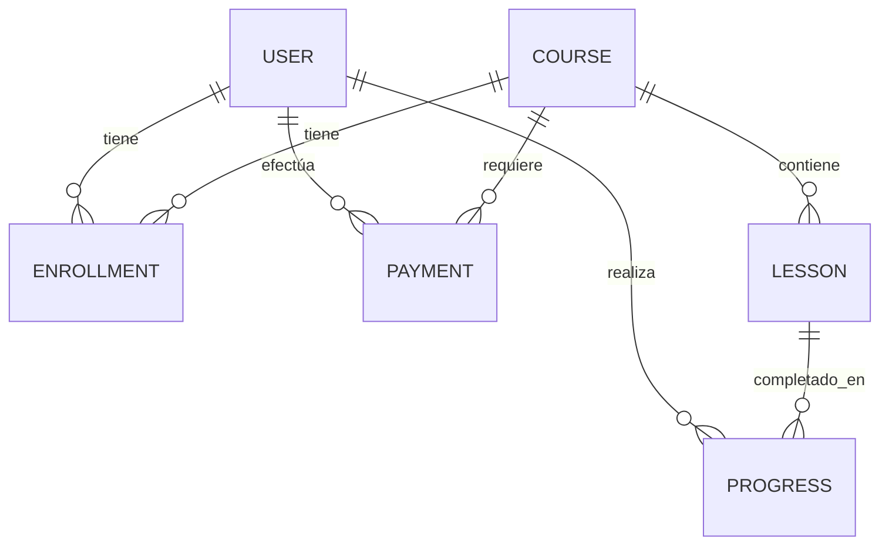

# 📚 Lumina Backend 🚀

> El motor que impulsa la plataforma de aprendizaje. Un backend robusto, seguro y escalable para gestionar usuarios, cursos, lecciones, matrículas, progreso y pagos.

<div align="center">

[](https://spring.io/projects/spring-boot)
[](https://www.oracle.com/java/)
[](https://www.postgresql.org/)
[](https://jwt.io/)
[](https://swagger.io/)
[](https://maven.apache.org/)
[](https://www.docker.com/)
[](https://render.com/)

[](https://back-e-learning-1.onrender.com)
[](https://render.com/)
[](https://opensource.org/licenses/MIT)

</div>

## 📑 Tabla de Contenidos

- [🚀 Características Principales](#-características-principales)
- [🛠️ Tecnologías](#%EF%B8%8F-tecnologías)
- [🚀 Despliegue](#-despliegue)
- [🔒 Seguridad](#-seguridad)
- [🔄 Flujo General](#-flujo-general)
- [📁 Estructura del Proyecto](#-estructura-del-proyecto)
- [⚙️ Configuración](#%EF%B8%8F-configuración)
- [📝 Licencia](#-licencia)

## 🚀 Características Principales

- **Autenticación y Autorización** segura con JWT
- Gestión completa de **cursos y lecciones**
- Sistema de **matrículas y pagos** integrado
- Seguimiento de **progreso de aprendizaje**
- Documentación de API con **Swagger**
- **Dockerizado** para fácil despliegue

## 🛠️ Tecnologías

- **Backend:** Spring Boot 2.7.0
- **Base de datos:** PostgreSQL 13
- **Autenticación:** JWT
- **Documentación:** Swagger/OpenAPI
- **Contenedorización:** Docker
- **Despliegue:** Render
- **Control de versiones:** Git

## 🚀 Despliegue

### 🌐 Backend en Producción
[](https://back-e-learning-1.onrender.com)

### 🗃️ Base de Datos
- **Motor:** PostgreSQL 13
- **Hosting:** Render

## 🔒 Seguridad, Confianza y Resiliencia Operativa

### 🎯 Beneficios Principales
1. **⚡ Recuperación más rápida ante fallos** - Sistema de respaldos inteligentes
2. **🤝 Mayor confianza del cliente** - Transparencia total en operaciones
3. **⚖️ Menos riesgo legal y reputacional** - Cumplimiento normativo garantizado
4. **📊 Facilita cumplimiento y auditorías** - Trazabilidad completa de acciones
5. **🛡️ Reducción de fraudes** - Protección automática contra amenazas

### 🔧 Mejoras Clave Implementadas
- **💾 Backups automáticos inteligentes** - Solo cuando hay cambios, optimizando espacio
- **🔐 Protección del inicio de sesión** - Bloqueo automático ante intentos sospechosos
- **📝 Registro de cambios (Auditoría)** - Trazabilidad completa de acciones

### 📈 Ejemplos de Impacto Real
- **⚡ Respuesta rápida:** Trazabilidad completa en 5 minutos para reclamaciones
- **🛡️ Detección proactiva:** Bloqueo automático ante accesos sospechosos
- **📊 Optimización:** Backups eficientes que ahorran espacio

## 🔄 Flujo General

1. **🧑‍🎓 Registro / Login** → Usuario obtiene token JWT
2. **🔐 Autorización** por roles (admin / estudiante)
3. **🎓 Explorar cursos** → Inscripción en cursos disponibles
4. **📘 Acceder a lecciones** → Completar contenido del curso
5. **📊 Seguimiento de progreso** → Monitoreo del avance del aprendizaje

## 📁 Estructura del Proyecto

```
src/
 └─ main/
     ├─ java/
     │    └─ com.elearning/
     │         ├─ config/       # Configuraciones (seguridad, Swagger, JWT, CORS)
     │         ├─ controller/   # Controladores de la API
     │         ├─ model/        # Entidades y DTOs
     │         ├─ repository/   # Repositorios de datos
     │         ├─ security/     # Configuración de seguridad
     │         └─ service/      # Lógica de negocio
     └─ resources/
          ├─ application.yml    # Configuración de la aplicación
          └─ static/            # Recursos estáticos
```

## ⚙️ Configuración

### Requisitos Previos
- Java 11 o superior
- Maven 3.6+
- PostgreSQL 13+
- Docker (opcional)

### Instalación

1. Clonar el repositorio:
   ```bash
   git clone [url-del-repositorio]
   cd back-e-learning
   ```

2. Configurar la base de datos en `application.yml`

3. Compilar el proyecto:
   ```bash
   mvn clean install
   ```

4. Ejecutar la aplicación:
   ```bash
   mvn spring-boot:run
   ```

### Uso con Docker

```bash
# Construir la imagen
docker build -t back-e-learning .

# Ejecutar el contenedor
docker run -p 8080:8080 back-e-learning
```

## 📝 Licencia

Este proyecto está bajo la Licencia MIT. Consulta el archivo [LICENSE](LICENSE) para más información.

## 📊 Modelo de Datos

### 📌 Entidades Principales



### 🗂️ Detalle de Entidades

#### 👤 USUARIO
- `id`: Identificador único (UUID)
- `name`: Nombre completo
- `email`: Correo electrónico (único)
- `password`: Contraseña encriptada
- `role`: Rol (ADMIN, INSTRUCTOR, ESTUDIANTE)

#### 📚 CURSO
- `id`: Identificador único (UUID)
- `title`: Título del curso
- `description`: Descripción detallada
- `price`: Precio (puede ser 0 para cursos gratuitos)
- `category`: Categoría del curso
- `level`: Nivel (Principiante, Intermedio, Avanzado)

#### 📝 LECCIÓN
- `id`: Identificador único (UUID)
- `title`: Título de la lección
- `content`: Contenido en formato Markdown/HTML
- `order`: Orden dentro del curso
- `duration`: Duración estimada en minutos

## 🔍 Documentación de la API

Puedes acceder a la documentación interactiva de la API en:
- **Swagger UI**: [http://localhost:8080/swagger-ui.html](http://localhost:8080/swagger-ui.html)
- **OpenAPI JSON**: [http://localhost:8080/v3/api-docs](http://localhost:8080/v3/api-docs)

### 🔐 Autenticación

```http
POST /api/auth/login
Content-Type: application/json

{
  "email": "usuario@ejemplo.com",
  "password": "contraseña123"
}
```

### 📚 Endpoints Principales

#### Usuarios
- `GET /api/users/me` - Obtener información del usuario autenticado
- `GET /api/users` - Listar usuarios (solo ADMIN)
- `GET /api/users/{id}` - Obtener usuario por ID
- `PUT /api/users/{id}` - Actualizar usuario
- `DELETE /api/users/{id}` - Eliminar usuario (solo ADMIN)

#### Cursos
- `GET /api/courses` - Listar todos los cursos
- `POST /api/courses` - Crear nuevo curso (solo INSTRUCTOR/ADMIN)
- `GET /api/courses/{id}` - Obtener curso por ID
- `PUT /api/courses/{id}` - Actualizar curso
- `DELETE /api/courses/{id}` - Eliminar curso (solo INSTRUCTOR/ADMIN)

#### Lecciones
- `GET /api/courses/{courseId}/lessons` - Listar lecciones de un curso
- `POST /api/courses/{courseId}/lessons` - Agregar lección a curso
- `GET /api/lessons/{id}` - Obtener lección por ID
- `PUT /api/lessons/{id}` - Actualizar lección
- `DELETE /api/lessons/{id}` - Eliminar lección

## 🚀 Despliegue

### Requisitos
- Java 11+
- Maven 3.6+
- PostgreSQL 13+
- Node.js 14+ (para frontend)

### Variables de Entorno
```bash
# Base de datos
SPRING_DATASOURCE_URL=jdbc:postgresql://localhost:5432/elearning
SPRING_DATASOURCE_USERNAME=postgres
SPRING_DATASOURCE_PASSWORD=tu_contraseña

# JWT
JWT_SECRET=tu_clave_secreta_muy_larga_y_segura
JWT_EXPIRATION_MS=86400000

# Otros
SPRING_PROFILES_ACTIVE=dev
```

### Docker Compose
Puedes levantar toda la infraestructura con Docker Compose:

```bash
docker-compose up -d
```

## 🤝 Contribución

1. Haz un fork del proyecto
2. Crea una rama para tu feature (`git checkout -b feature/AmazingFeature`)
3. Haz commit de tus cambios (`git commit -m 'Add some AmazingFeature'`)
4. Haz push a la rama (`git push origin feature/AmazingFeature`)
5. Abre un Pull Request

## 📄 Licencia

Distribuido bajo la licencia MIT. Ver `LICENSE` para más información.

## ✨ Reconocimientos

- [Spring Boot](https://spring.io/projects/spring-boot)
- [PostgreSQL](https://www.postgresql.org/)
- [JWT](https://jwt.io/)
- [Swagger](https://swagger.io/)
- [Render](https://render.com/)

---

<div align="center">
  Hecho con ❤️ por el equipo de Lumina - Equipo 4 -LATAM | 2025
</div>
